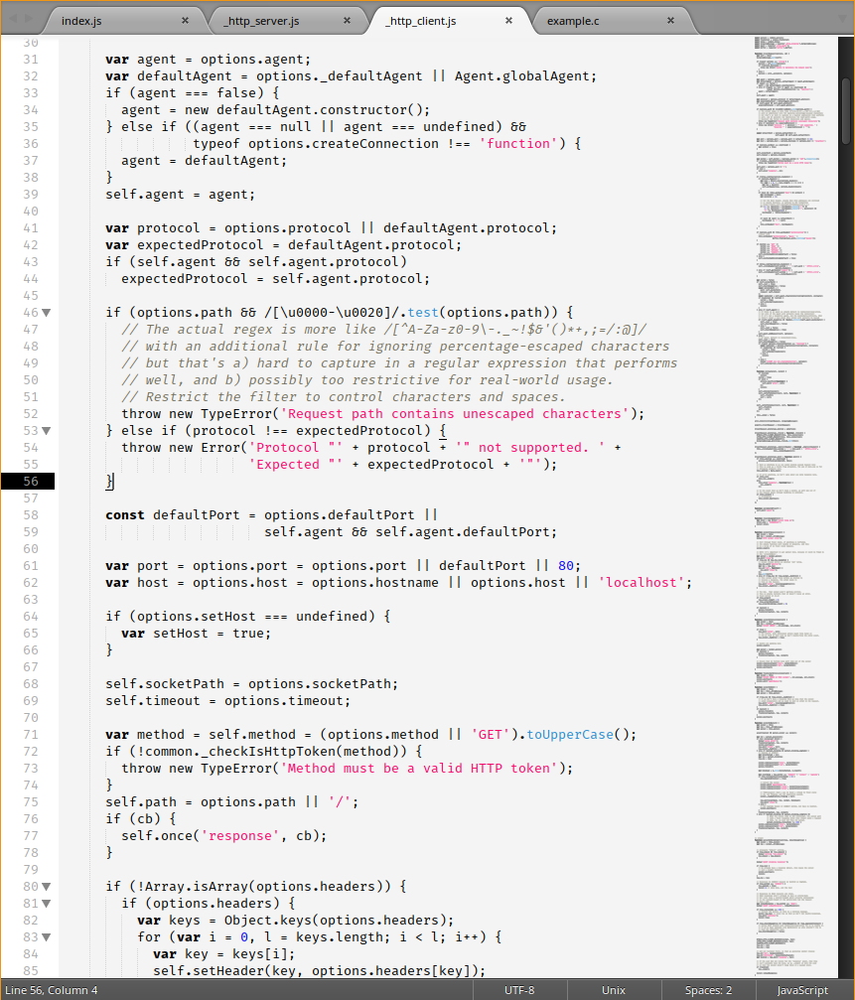

# Pushkin-is-white-sublime

- Drop the file into Sublime HOME directory, example: /home/${USER}/.config/sublime-text-3/Packages/User/Pushkin-is-White.tmTheme;
- Edit your preferences file: { "color_scheme": "Packages/User/Pushkin-is-White.tmTheme" }.

Fira Mono font face is used in the screenshot.
